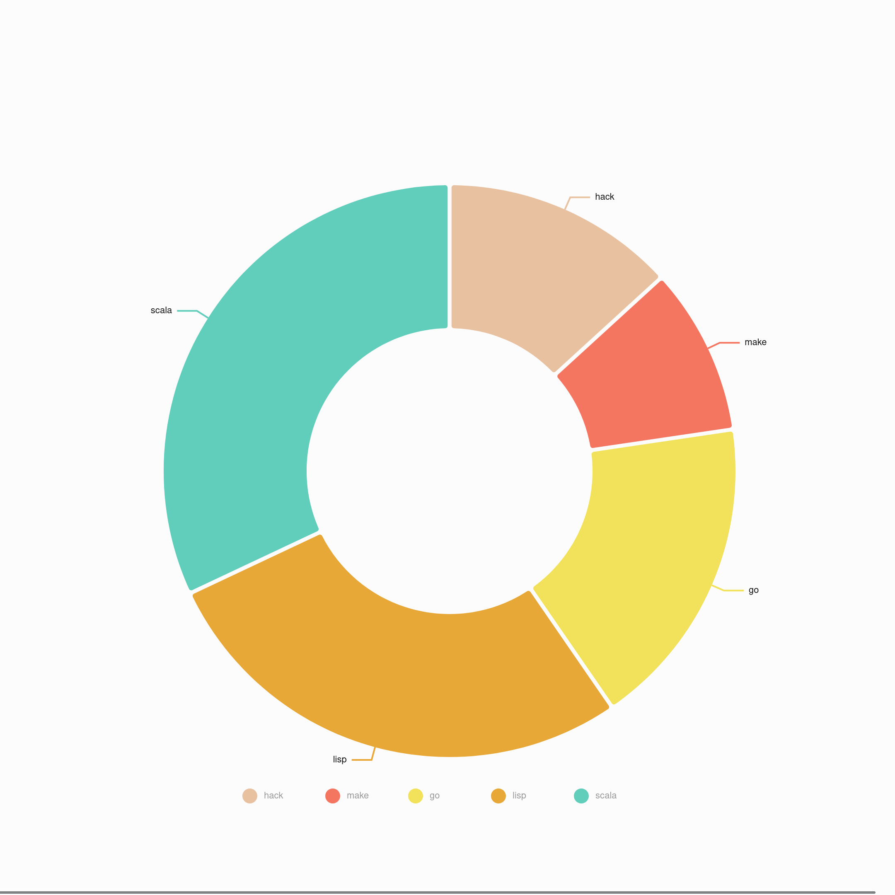

# dashboard

- **MERN project** built with Material UI design

- Dark/Light mode support

- Graphic rich for showcasing dashboard data, and could easily be expanded and customized. 

- Replaced Google Fonts with Coollabs alternatives for privacy concerns. 

## Technologies Used

- Frontend: MUI; Emotion; Nivo; react-router-dom; react-datepicker; react-redux; redux.js
- Backend: body-parser; helmet; morgan; country-iso-2-to-3; cors

## How to Use

This dashboard is meant to showcasing how information can be gathered and processed to an user or administrator or super-administrator of a certain platform, for example, an E-commerce platform. 

- list all the products available on the platform.

- list of customers with their user details. 

- list of transactions, with columns and density customizable. 

- See where your users/clients are located throughout the world. 

- Sales Overview, daily and monthly sales performance, breakdown of sales by categories. 

- Manage your users and track affiliate sales performance. 

- Reports ready to be downloaded to your local machine. 

## What's Next

- Setting

- Registration / Login

- Authorization matrix. 

- Tickets / feedback to a specific user, if it's authorized to do so. 
